# Formula one plus

Aplicativo criado para acompanhar o resultado de uma temporada da
Formula One, o usuário após logar pode acessar informações das corridas
a partir de 1950, com acesso à tabela final da temporada, e colocações dos pilotos
e construtoras no ano pesquisado. Os dados são coletados da Formula One API.

## Casos de uso

## [Trello](https://trello.com/b/hbhV98kr/f1-plus-app) com backlog e simulação da primeira sprint

### Primeira sprint:

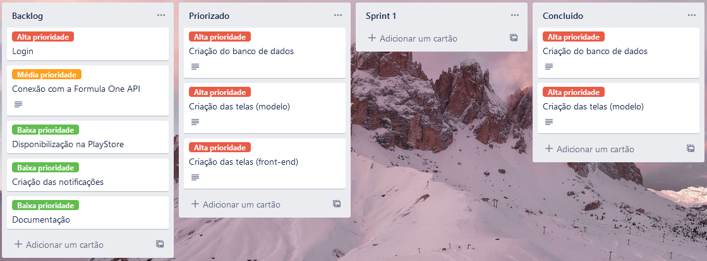

### Burndown chart:

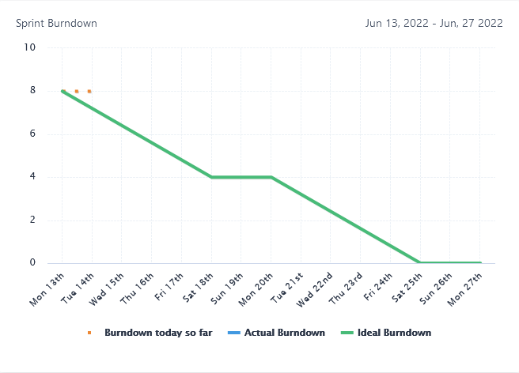
## Telas
### Inicio
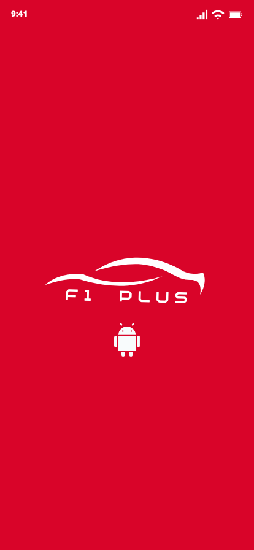
### Login

### Registro
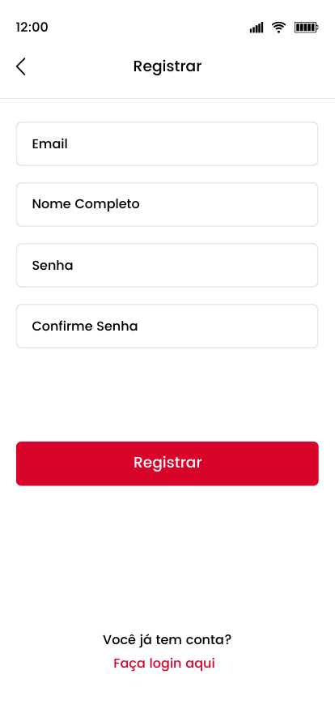
### Logado - menu do usuário
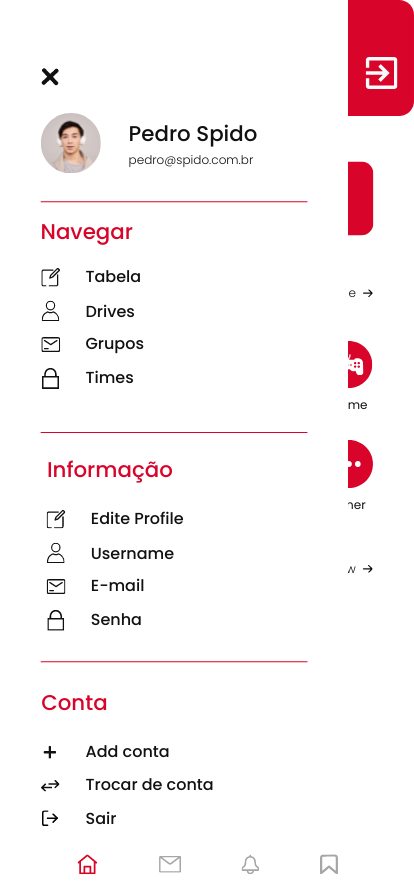
### Logado - Classificação pilotos - temporada atual
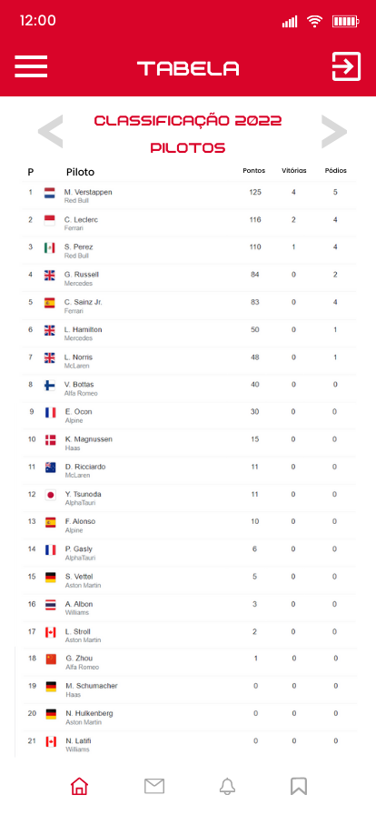
### Logado - Classificação pilotos - temporada arbitrária
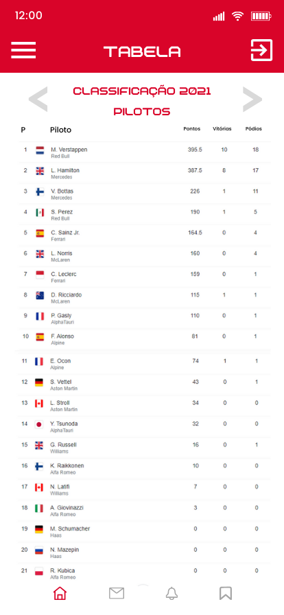
### Logado - Classificação construtores - temporada atual
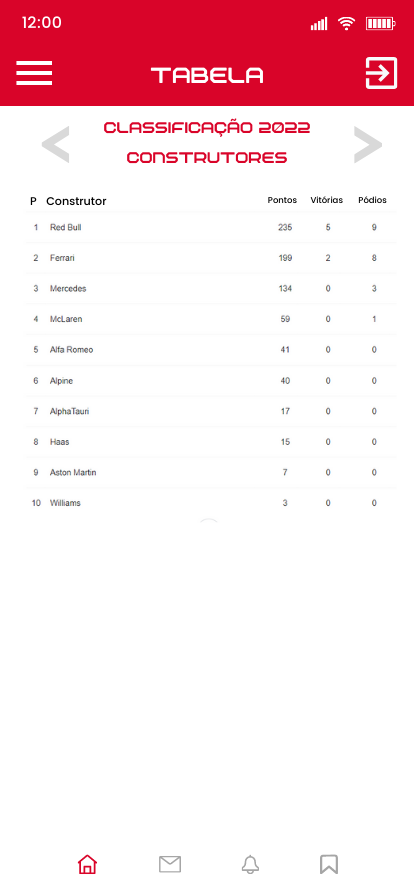
### Logado - Classificação construtores - temporada arbitrária
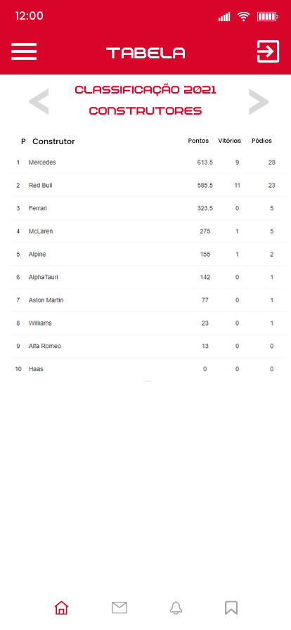
### Logado - Pilotos
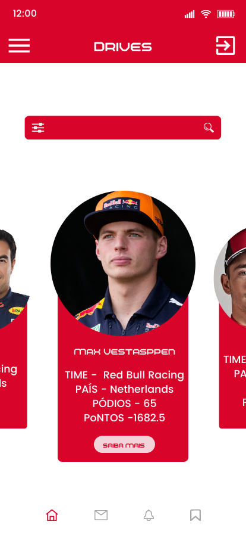
### Logado - Piloto escolhido
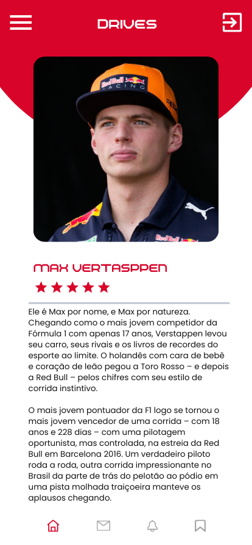
### Logado - Construtores
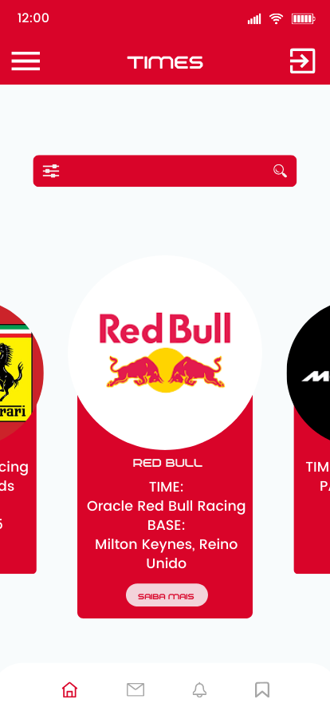
### Logado - Construtor escolhido
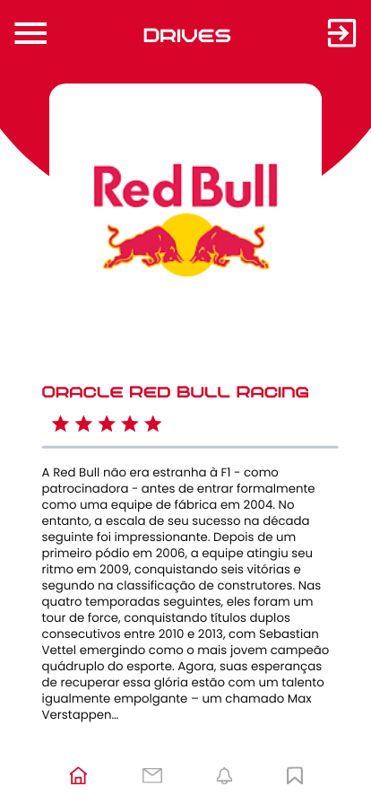

## Plano de testes:
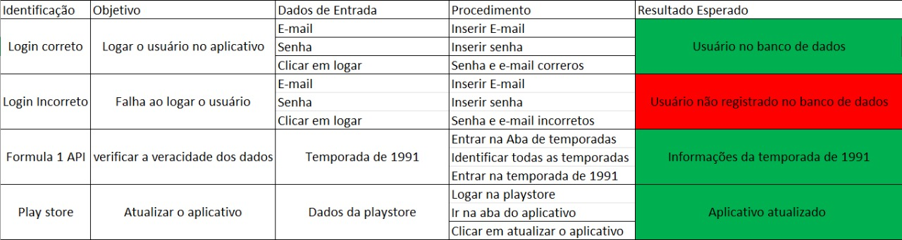
